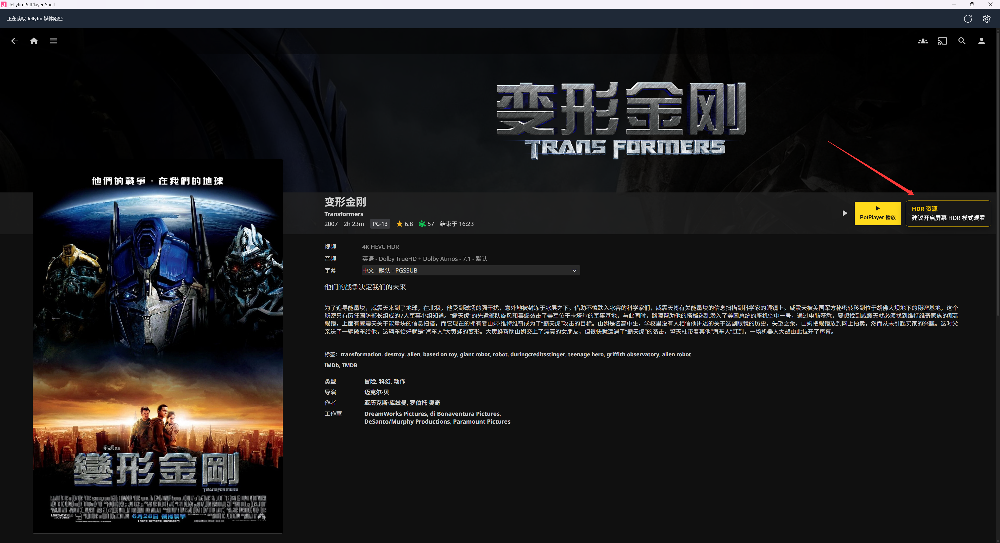

# Jellyfin PotPlayer Shell

一款面向 Windows 11 x64 的 Jellyfin 桌面外壳客户端：保留原版 Jellyfin Web 的浏览、搜索、海报墙和详情页，同时在可播放条目旁加入醒目的黄色 **“PotPlayer 播放”** 按钮，将 NAS 或本机上的原始媒体文件直接交给 PotPlayer。

> 当前版本：**v0.8.0** · 技术栈：**.NET 8 / WPF / WebView2** · 自动化测试：**135 项**

[下载最新版](https://github.com/Dongz9870/jellypot-shell/releases/latest) · [查看 v0.8.0 发布说明](https://github.com/Dongz9870/jellypot-shell/releases/tag/v0.8.0) · [提交问题](https://github.com/Dongz9870/jellypot-shell/issues)

## 界面预览

应用直接承载 Jellyfin Web，因此海报墙、搜索、分类、收藏和用户习惯都保持不变；窗口右上角只增加了刷新与设置入口。


## 它解决什么问题

Jellyfin 自带播放器适合串流播放，但在 Windows HTPC、NAS 原盘、超高码率媒体或需要 PotPlayer 解码器链的环境中，用户通常希望直接播放原始文件。传统方案往往需要浏览器扩展、用户脚本、注册表协议或 PowerShell。

Jellyfin PotPlayer Shell 把这条链路封装成一个普通 Windows 应用：

```text
打开 Jellyfin PotPlayer Shell
→ 像平时一样浏览 Jellyfin
→ 进入电影、单集或视频详情页
→ 点击黄色“PotPlayer 播放”按钮
→ PotPlayer 直接打开原始媒体文件
```

最终用户不需要安装浏览器扩展、导入注册表、编辑脚本或修改 Jellyfin 安装文件。

## 主要功能

### 原版 Jellyfin 体验

- 使用 WebView2 承载原版 Jellyfin Web，不重新实现媒体库界面。
- 保留 Jellyfin 的登录、海报墙、搜索、分类、详情、收藏和多用户体验。
- WebView2 用户数据独立持久化，关闭应用后仍可保留 Jellyfin 登录状态。
- 适配 Jellyfin 单页应用的前进、后退和页面切换，黄色按钮不会重复插入。

### 一键调用 PotPlayer

- 在 `Movie`、`Episode` 和 `Video` 详情页的原播放按钮旁显示黄色按钮。
- `Series`、`Season`、`Folder` 和音频类页面不显示该按钮。
- 复用当前 Jellyfin 登录会话读取条目及 `MediaSources`，无需再次输入 Jellyfin 密码。
- 自动查找 64 位 `PotPlayerMini64.exe`；也可以在设置中手动选择。
- 通过安全的参数列表启动 PotPlayer，带空格、中文和 UNC 路径无需用户手工转义。
- PotPlayer 路径只允许来自本机受信配置、自动检测或用户手动选择，网页不能指定任意 EXE。

### 原始文件直放与多版本选择

- PotPlayer 直接读取本地文件、映射盘符或 UNC 共享，不经过 Jellyfin 视频转码。
- 支持常规单文件媒体，例如 MKV、MP4，以及 PotPlayer 能正常处理的其他容器。
- 条目存在多个媒体版本时，会先显示版本选择窗口，再播放用户选中的版本。
- 播放前检查 Windows 是否能够访问目标路径，并用中文提示 NAS 离线、共享不可达或文件不存在等问题。
- 不移动、不重命名、不修改媒体文件，也不会改变 qBittorrent 保存目录或影响做种。

### HDR 资源提醒

应用会根据用户实际选择的媒体源识别 HDR、HDR10、HDR10+、HLG 和 Dolby Vision 元数据。识别成功后，点击黄色按钮会在按钮旁提示开启屏幕 HDR 模式，然后继续启动 PotPlayer；SDR 资源不会显示提醒。



> 提醒仅用于告知用户，不会自动修改 Windows 显示设置。

### Blu-ray 原盘目录播放

- 当 Jellyfin 返回影片根目录时，识别其中的 `BDMV/index.bdmv`。
- 当 Jellyfin 直接返回 `BDMV` 目录时，同样定位 `index.bdmv`。
- 将 `index.bdmv` 作为单个参数交给 PotPlayer，让播放器按 Blu-ray 原盘结构打开。
- 缺少 `BDMV/index.bdmv` 时给出明确的中文诊断，不递归猜测其他文件。

### 路径映射与超长路径处理

Jellyfin Server 看到的媒体路径不一定能被 Windows 客户端直接访问。应用支持多条路径映射规则，并始终采用**最长前缀优先**：

```text
\\NAS\Media\Movies\  →  M:\
\\NAS\Media\TV\      →  T:\
\\NAS\Media\         →  \\NAS\Media\
```

- 支持 UNC → UNC、UNC → 盘符及其他服务器路径 → Windows 路径。
- 自动统一斜杠并保留剩余子目录，不会生成 `file:///?/UNC/...`。
- 设置页可以添加、删除、启用或停用映射规则。
- 可创建并管理应用负责的 `M:` / `T:` 网络盘短路径。
- 不覆盖已占用盘符，不保存 NAS 密码；网络盘使用当前 Windows 凭据。

### 首次设置与日常维护

- 首次启动向导依次检查 Jellyfin Server、PotPlayer 和预设 NAS 位置。
- 支持检测常用 Jellyfin 地址并测试连接。
- 支持自动检测 PotPlayer，检测失败时可浏览选择 `PotPlayerMini64.exe`。
- 可选择创建电影和电视剧短盘符；这只增加 Windows 访问入口，不改变 NAS 文件。
- 设置页支持重新运行向导、编辑路径映射和断开由本应用创建的盘符。
- 主窗口提供常用的刷新与设置图标按钮。

### Windows 安装体验

- 提供 Windows 11 x64 自包含安装程序，用户无需单独安装 .NET Runtime。
- 安装器检查 WebView2 Runtime；缺失时使用随安装包提供的微软引导程序安装。
- 创建开始菜单快捷方式，并可选择创建桌面快捷方式。
- 支持标准卸载；卸载应用时保留用户设置与 Jellyfin 登录数据，便于以后重新安装。
- EXE、窗口、任务栏和安装器使用统一的粉色 JellyPot 图标。

## 工作原理


界面层只负责识别详情页、插入按钮并发送条目 ID；C# 层负责验证消息来源、读取媒体信息、选择版本、检测 HDR、映射和诊断路径以及启动 PotPlayer。Jellyfin Token 不写入日志或普通配置文件。

## 系统要求

- Windows 11 x64（安装器最低系统版本为 Windows 11 21H2 / Build 22000）。
- 可从当前电脑访问的 Jellyfin Server。
- 64 位 PotPlayer，主程序文件名为 `PotPlayerMini64.exe`；安装包不包含 PotPlayer。
- Windows 必须能够通过原路径或配置后的映射路径访问媒体文件。
- NAS 场景建议先在资源管理器中确认共享及 Windows 凭据可用。

## 安装与首次使用

1. 打开 [Releases](https://github.com/Dongz9870/jellypot-shell/releases/latest)，下载 `JellyfinPotPlayerShell-Setup-x64.exe`。
2. 运行安装程序并按提示完成安装。
3. 首次打开时，在向导中确认 Jellyfin Server 地址。
4. 让应用自动检测 PotPlayer，或手动选择 `PotPlayerMini64.exe`。
5. 根据需要检查 NAS 并创建短盘符，然后选择“完成设置并打开”。
6. 在应用内登录 Jellyfin，打开电影或单集详情页并点击黄色按钮。

### 关于 Windows 安全提示

当前公开安装包尚未进行商业代码签名，因此 Windows 可能显示“未知发布者”或 Microsoft Defender SmartScreen 提示。请只从本仓库的 [GitHub Releases](https://github.com/Dongz9870/jellypot-shell/releases) 下载，并按发布页提供的 SHA-256 校验文件。

## 常见问题

### 为什么节目或季页面没有黄色按钮？

这是预期行为。`Series` 和 `Season` 本身不是具体媒体文件；进入某一集的详情页后才会显示黄色按钮。

### 为什么黄色按钮能看到，但 PotPlayer 提示路径不可访问？

Jellyfin Server 返回的是服务器侧路径。请确认 Windows 可以访问同一个 UNC 路径，或在“设置 → 路径映射”中把服务器路径前缀映射到本机盘符/UNC 路径。

### 会修改 Jellyfin、qBittorrent 或媒体文件吗？

不会。应用不修改 Jellyfin 安装文件，不修改 qBittorrent 保存目录，也不移动、重命名或写入媒体文件。网络盘和路径映射只是为同一文件增加 Windows 访问入口。

### 会自动开启 Windows HDR 吗？

不会。应用只显示提醒，HDR 开关仍由用户在 Windows 显示设置中控制。

### 为什么普通浏览器里看不到黄色按钮？

按钮由本应用在自身 WebView2 窗口中运行时注入，不会修改 Jellyfin Server，所以普通浏览器和其他 Jellyfin 客户端不会出现该按钮。

## 配置与日志

```text
用户设置：%APPDATA%\JellyfinPotPlayerShell\settings.json
Web 登录：%LOCALAPPDATA%\JellyfinPotPlayerShell\WebView2
运行日志：%LOCALAPPDATA%\JellyfinPotPlayerShell\Logs
```

- 设置文件采用 UTF-8 和原子写入。
- Jellyfin Token、Jellyfin 密码、NAS 密码和 Windows 凭据不会写入日志。
- 日志用于记录应用状态、媒体源数量、路径长度、映射规则 ID 和错误诊断，不记录完整访问令牌。

## 从源码构建

开发环境：Windows 11 x64、.NET 8 SDK；生成安装器还需要 Inno Setup 6。

```powershell
git clone https://github.com/Dongz9870/jellypot-shell.git
cd jellypot-shell

dotnet build -c Release
dotnet test -c Release
```

生成自包含安装包：

```powershell
powershell.exe -NoProfile -ExecutionPolicy Bypass `
  -File .\scripts\build-installer.ps1
```

输出文件：

```text
artifacts\installer\JellyfinPotPlayerShell-Setup-x64.exe
```

## 项目结构

```text
src/JellyfinPotPlayerShell.App   WPF、WebView2、设置向导和 Windows 服务
src/JellyfinPotPlayerShell.Core  Jellyfin 模型、路径映射、HDR 与播放逻辑
tests/                           xUnit 自动化测试
installer/                       Inno Setup 安装器
scripts/                         发布与安装包构建脚本
config/                          配置示例
docs/                            开发手册、测试计划及图片资源
```

## 当前边界

- 当前仅发布 Windows 11 x64 版本。
- 这是原始文件直放工具，不提供远程串流 URL 或 Jellyfin 转码回退。
- 媒体路径必须能被运行应用的 Windows 电脑访问。
- Jellyfin Web 的 DOM 可能随版本变化；适配逻辑集中在独立的 Web 适配器中，并由回归测试覆盖常见页面结构。
- 当前安装包未进行商业代码签名。

## 第三方项目声明

- [Jellyfin](https://jellyfin.org/) 是独立的开源媒体系统。
- PotPlayer 是独立的第三方媒体播放器，本项目及安装包不重新分发 PotPlayer。
- 本项目与 Jellyfin 官方及 PotPlayer 官方不存在隶属、授权或背书关系。
- 项目名称和界面中的相关商标归各自权利人所有，仅用于描述兼容性和功能用途。

## 开发文档

- [开发手册](docs/DEVELOPMENT_MANUAL.md)
- [配置示例](config/appsettings.example.json)
